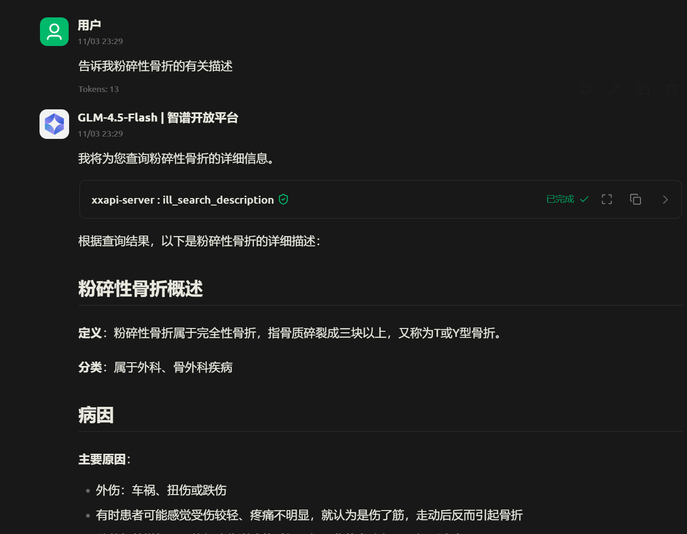

# XXAPI（小小API）医学接口部分功能说明与使用标示

---
BHC876

+ 接口详细状况部分见：[XXAPI分析](./xxAPI性能分析.md)

## 基本信息展示
- URL：`https://v2.xxapi.cn/api/disease`
- API_Key：预测项目进行期间，本API端口都是免费开放端口，无秘钥
- 说明页面：`https://xxapi.cn/doc/disease#description`
- （[说明页面](https://xxapi.cn/doc/disease#description)）
- 分封功能：
  - 完全详细信息（medic_search_detail）
  - 常规使用信息（medic_search）
  - 精简可用信息（medic_search_simple）
  - 详细描述信息（medic_search_description）
  - 所有药物信息（medic_search_detail_medicine）
  - 搜索所得列表（medic_search_list）
- 反馈情况（粗调）展示-模型GLM-4.5-Flash

- 联系其他功能：暂无（2025年11月3日注：可能前后关系CPubMedAPI中的部分有效功能）
- 部署端口：本机9090端，sse子端
## 调用细节：
- 使用uv运行程序，或直接使用Python运行程序
- sse连接方式
- 连接默认URL：
  - `http://localhost:9090/sse` (Windows)
  - `http://0.0.0.0:9090/sse` (Linux/MacOS)

---
### 其他信息
- 工具作者：BHC876
  - 个人站：https://github.com/bihongcui876
  - QQ邮箱：1581672842@qq.com
- API来源：小小API工具
  - 小小API是山东省云鹊网络科技有限公司推出的免费API数据接口调用平台，为开发者提供快速、稳定、可靠的API数据服务，涵盖多种聚合数据接口，助力高效开发。
  - 邮箱：support@yunque.cc
  - 电话：+86 13188880632
  - 地址：山东省枣庄市滕州市官桥镇迎贤苑10号
  - 工作时间：工作日 8:00-24:00