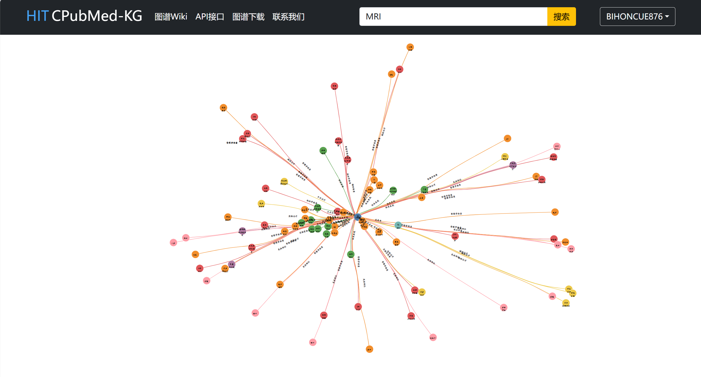
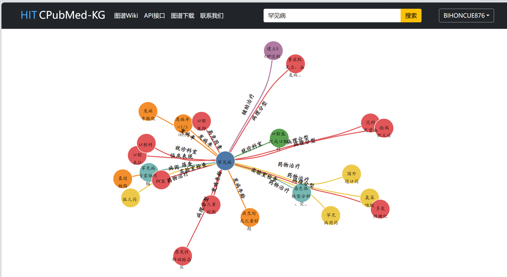

# CPubMed栈内自带搜索效果

1. 搜索词：冠心病（反馈同API信息词汇一致）
- 选用原因：反应特别类病症
- 

2. 搜索词：关节炎（反馈同API信息词汇一致）
- 选用原因：反应宽泛类病症
- 

3. 搜索词：MRI（反馈同API信息词汇一致）
- 选用原因：反应方法或医疗医检仪器方法词汇
- 

4. 搜索词：罕见病（反馈同API信息词汇一致）
- 选用原因：反应模糊类病症
- 

5. 搜索词：甲基苯丙胺（反馈同API信息词汇一致）
- 选用原因：当今少用药物或禁忌禁用类药物
- 

6. 搜索词：甲基苯丙胺（三元组信息展示）
- 选用原因：当今少用药物或禁药毒品及其治疗信息
- 